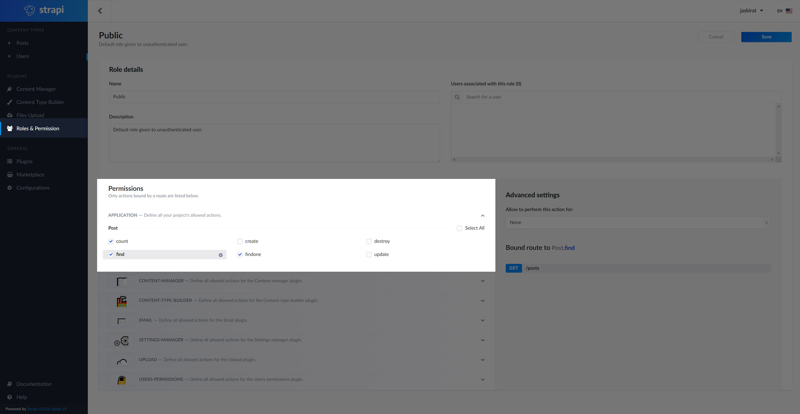

## Initialize Strapi

Postmate uses Strapi as CMS. Once deployed, locally or on cloud, we'll need to initialize Strapi.

1. Create the first user.
2. From `Content Type Builder`, create a new content type `Post`
3. Give read access to public. Locally it would expose the content via `http://localhost:1337/posts`
4. Create your first post and save.
5. Navigate to `localhost` to view your newly created content.

**Note:** URL for the uploaded images will depend on the exposed endpoints of your deployment.

