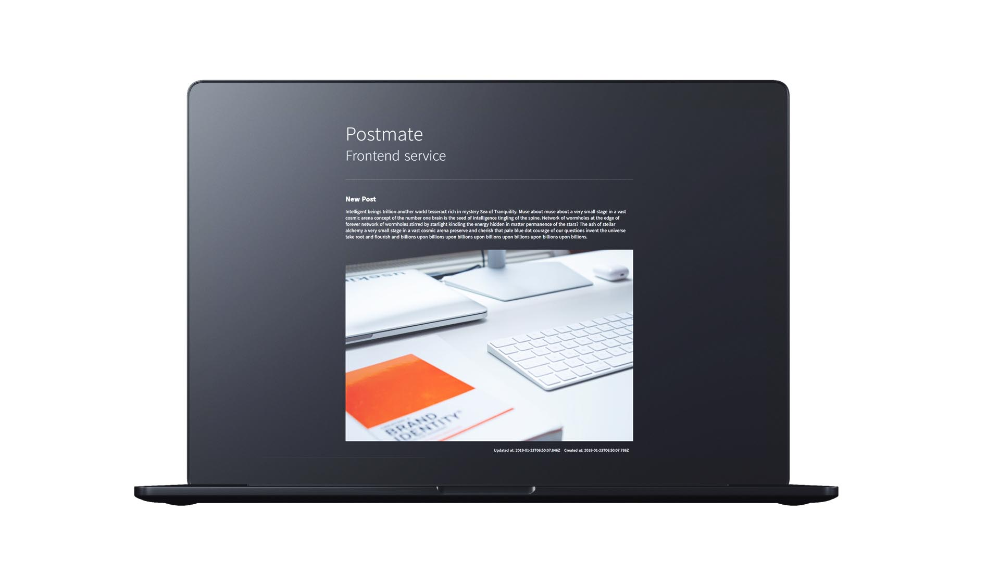

# K8S Sample Deployment

Postmate - A sample application to demonstrate [container native development](https://cloudblogs.microsoft.com/opensource/2018/04/23/5-reasons-you-should-be-doing-container-native-development/) using Docker and Kubernetes.

<p align="center">
  
</p>

## Prerequisites

- [Docker](https://www.docker.com/) and [Docker Compose](https://github.com/docker/compose)
- [Minikube](https://github.com/kubernetes/minikube) and [Kubectl](https://github.com/kubernetes/kubectl)
- [Kops](https://github.com/kubernetes/kops)

## Microservices

Postmate is built with following microservices.

- Front-end built with Nuxt (Vue.js)
- Strapi CMS
- MongoDB

## Local Development - Docker Compose

We'll use Docker Compose to spin up a development environment with all the services connected to each other

### 1. Persistent Storage

To maintain persistent storage for each container we'll mount local host directories. Except for MongoDB, for which we'll create a named volume.

```sh
# (Run once) Create a external named volume for MongoDB
docker volume create mongodbdata
```

### 2. Development

Start the services. The frontend also supports live-reload so the changes are reflected in the browser.

```sh
# Start the services
docker-compose up
# Stop the services
docker-compose down
```

Following endpoints are exposed to browser:

- Frontend: `localhost`
- CMS: `localhost:1337`

### 3. Build and Push Images

Once satisfied with development updates the images can be built and pushed the image to registry, in this case, Docker Hub.

```sh
# Build individual images
docker build -t jaskiratr/k8s-postmate-frontend:latest ./frontend
docker build -t jaskiratr/k8s-postmate-cms:latest ./cms

# Build all images at once
docker-compose build

# Push to Docker Hub
docker push jaskiratr/k8s-postmate-frontend
docker push jaskiratr/k8s-postmate-cms
```

## Deployment

We'll use Kubernetes for deploying our microservices.
The deployment guides are listed under `k8s-manifests`

- [Local deployment with Minikube](k8s-manifests/minikube) : For testing the deployment on local machine first.
- [AWS deployment with Kops](k8s-manifests/aws) : Production deployment on AWS with Kops

## Initialize Application

Follow the guide [here](initialize-cms.md) to initialize Postmate with minimal setup.

### To Do

- Architecture Diagram
- GCP deployment guide with kops
- ELK stack for logging
- Prometheus and Grafana stack for monitoring
- Alert manager for alerts.
